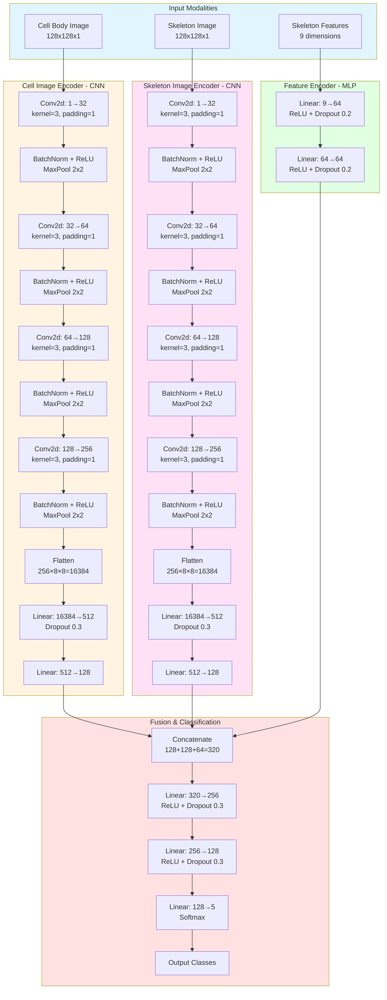
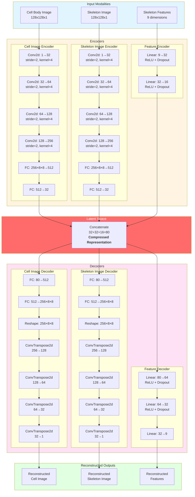

# Deep Learning Architectures for Microglia Morphology Analysis

## 1. Supervised Classifier Architecture

---

## 2. Unsupervised Autoencoder Architecture

---

## 3. Denoising Autoencoder Architecture

```mermaid
flowchart TD
    subgraph INPUT3["Input Modalities"]
        DI1["Cell Body Image<br/>128x128x1"]
        DI2["Skeleton Image<br/>128x128x1"]
        DI3["Skeleton Features<br/>9 dimensions"]
    end
    
    subgraph NOISE["Noise Addition Layer"]
        N1["Gaussian Noise<br/>σ=0.1"]
        N2["Salt & Pepper<br/>amount=0.05"]
        N3["Feature Dropout<br/>p=0.1"]
    end
    
    subgraph NOISY["Noisy Inputs"]
        NI1["Noisy Cell Image"]
        NI2["Noisy Skeleton"]
        NI3["Noisy Features"]
    end
    
    subgraph DENCODERS["Encoders"]
        subgraph DCE["Cell Image Encoder"]
            DCE1["Conv2d: 1→32<br/>stride=2, kernel=4"]
            DCE2["Conv2d: 32→64<br/>stride=2, kernel=4"]
            DCE3["Conv2d: 64→128<br/>stride=2, kernel=4"]
            DCE4["Conv2d: 128→256<br/>stride=2, kernel=4"]
            DCE5["FC: 256×8×8→512"]
            DCE6["FC: 512→32"]
            DCE1 --> DCE2 --> DCE3 --> DCE4 --> DCE5 --> DCE6
        end
        
        subgraph DSE["Skeleton Image Encoder"]
            DSE1["Conv2d: 1→32<br/>stride=2, kernel=4"]
            DSE2["Conv2d: 32→64<br/>stride=2, kernel=4"]
            DSE3["Conv2d: 64→128<br/>stride=2, kernel=4"]
            DSE4["Conv2d: 128→256<br/>stride=2, kernel=4"]
            DSE5["FC: 256×8×8→512"]
            DSE6["FC: 512→32"]
            DSE1 --> DSE2 --> DSE3 --> DSE4 --> DSE5 --> DSE6
        end
        
        subgraph DFE["Feature Encoder"]
            DFE1["Linear: 9→32<br/>ReLU + Dropout"]
            DFE2["Linear: 32→16<br/>ReLU + Dropout"]
            DFE1 --> DFE2
        end
    end
    
    subgraph DLATENT["Latent Space"]
        DLAT["Concatenate<br/>32+32+16=80<br/><b>Robust Features</b>"]
    end
    
    subgraph DDECODERS["Decoders"]
        subgraph DCD["Cell Image Decoder"]
            DCD1["FC: 80→512"]
            DCD2["FC: 512→256×8×8"]
            DCD3["Reshape: 256×8×8"]
            DCD4["ConvTranspose2d<br/>256→128"]
            DCD5["ConvTranspose2d<br/>128→64"]
            DCD6["ConvTranspose2d<br/>64→32"]
            DCD7["ConvTranspose2d<br/>32→1"]
            DCD1 --> DCD2 --> DCD3 --> DCD4 --> DCD5 --> DCD6 --> DCD7
        end
        
        subgraph DSD["Skeleton Image Decoder"]
            DSD1["FC: 80→512"]
            DSD2["FC: 512→256×8×8"]
            DSD3["Reshape: 256×8×8"]
            DSD4["ConvTranspose2d<br/>256→128"]
            DSD5["ConvTranspose2d<br/>128→64"]
            DSD6["ConvTranspose2d<br/>64→32"]
            DSD7["ConvTranspose2d<br/>32→1"]
            DSD1 --> DSD2 --> DSD3 --> DSD4 --> DSD5 --> DSD6 --> DSD7
        end
        
        subgraph DFD["Feature Decoder"]
            DFD1["Linear: 80→64<br/>ReLU + Dropout"]
            DFD2["Linear: 64→32<br/>ReLU + Dropout"]
            DFD3["Linear: 32→9"]
            DFD1 --> DFD2 --> DFD3
        end
    end
    
    subgraph OUTPUT3["Clean Reconstructed Outputs"]
        DO1["Clean Cell Image<br/><i>(Denoised)</i>"]
        DO2["Clean Skeleton<br/><i>(Denoised)</i>"]
        DO3["Clean Features<br/><i>(Denoised)</i>"]
    end
    
    DI1 --> N1
    DI2 --> N2
    DI3 --> N3
    
    N1 --> NI1
    N2 --> NI2
    N3 --> NI3
    
    NI1 --> DCE1
    NI2 --> DSE1
    NI3 --> DFE1
    
    DCE6 --> DLAT
    DSE6 --> DLAT
    DFE2 --> DLAT
    
    DLAT --> DCD1
    DLAT --> DSD1
    DLAT --> DFD1
    
    DCD7 --> DO1
    DSD7 --> DO2
    DFD3 --> DO3
    
    style INPUT3 fill:#e1f5ff
    style NOISE fill:#ffcc00
    style NOISY fill:#ff9999
    style DENCODERS fill:#fff4e1
    style DLATENT fill:#9b59b6,color:#fff
    style DDECODERS fill:#ffe1f5
    style OUTPUT3 fill:#90ee90
```

---

## Architecture Comparison Summary

| Architecture | Purpose | Latent Dimension | Key Feature |
|-------------|---------|------------------|-------------|
| **Supervised Classifier** | Cell classification | 320 (fusion) | Supervised learning with labeled data |
| **Unsupervised Autoencoder** | Feature learning & clustering | 80 | Self-supervised reconstruction |
| **Denoising Autoencoder** | Robust feature extraction | 80 | Learns robust features from noisy inputs |

